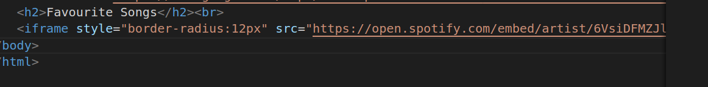

# Tribute Page
1.
##### Explanation
* here in body h1 tag is used for main heading
* p tag is used for paragraph 

2.
##### Explanation
* h2 tag is used for second heading
* iframe is an inline elemnt that allows us to embed another document or webpage within the current document.
* scrolling Attribute:
The scrolling attribute controls whether scrollbars are displayed within the iframe when the content inside it is larger than the iframe's dimensions. It can take one of three values:

   * "yes": Display both horizontal and vertical scrollbars.
   * "no": Do not display any scrollbars, even if the content is larger.
   * "auto": Display scrollbars only if the content overflows the iframe's dimensions.
   * The allowtransparency attribute indicates whether the background of the iframe should be transparent.
   * The allowfullscreen attribute is used with iframes that embed content like videos or maps and allows the embedded content to be viewed in full-screen mode when the user clicks on a full-screen button provided by the embedded content.
   * the frameborder attribute is used to control whether a border is displayed around the iframe's content

3.
##### Explanation
* the class attribute is empty.CSS classes can be assigned here to style the iframe using CSS.
* style Attribute:
The style attribute is used to apply inline CSS styles directly to the iframe.
* The styles applied include position, visibility, width, height, display, and flex-grow. These styles control the positioning, size, and display behavior of the iframe.
* width and height to set image peoperly.
* br tag is used to give line break.

4.
##### Explanation
* h2 tag is used for second heading.
* here iframe is used to embed image and instagram post and google maps in current document.

5.
##### Explanation
* scrolling Attribute:
The scrolling attribute controls whether scrollbars are displayed within the iframe when the content inside it is larger than the iframe's dimensions. It can take one of three values:

   * "yes": Display both horizontal and vertical scrollbars.
   * "no": Do not display any scrollbars, even if the content is larger.
   * "auto": Display scrollbars only if the content overflows the iframe's dimensions.

6.
##### Explanation
* here iframe i used to embed spotify playlist in current doucument

